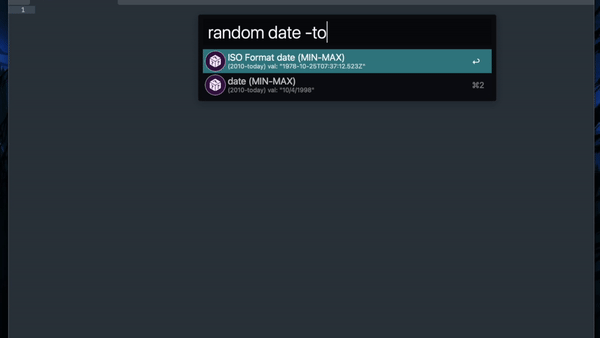

# Random Everything

An Alfred Workflow that generates random ints, floats, strings, words, etc.

This is inspired by [Random Everything for VS Code.](https://github.com/helixquar/randomeverything)

## Demo

## Type "random":

- `address`: A random address (e.g. 1750 Nugku Place)
- `city`: A random city (e.g. Ejgekad)
- `country`: A random country (e.g. Fidorini)
- `color`: A random hex color formatted (e.g. "#dd505d")
- `date` (MIN-MAX): (e.g. 2006-12-20T10:20:31.608Z)
- `date` (MIN-MAX): (e.g. 23/10/2027)
- `email`: A random E-mail address (e.g. hugzet@ricardosampayo.com)
- `float` (MIN-MAX): A range from a-b separated with `-`. Default: 0-1 (e.g. 0.609)
- `int` (MIN-MAX): A range from a-b separated with `-`. Default: 1-100 (e.g. 57)
- `ip`: a random ipv4 ip address (e.g. 152.136.48.249)
- `name`: A random NAME (e.g. Isabelle Holland)
- `firstName`: A random first name (e.g. Seth)
- `lastName`: A random last name (e.g. Fiesoli)
- `letters` (length): Random letters (e.g. SsvnOZyMsjZxXmHOpax)
- `lettersAndNumbers` (length): Random letters and numbers (e.g. jvYjV2Kk7D)
- `loremWorlds` (number): Random lorem ipsum worlds with length (default 7)
- `loremSentences` (number): Random lorem ipsum sentences with length (default 3)
- `loremParagraphs` (number): Random lorem ipsum paragraphs with length (default 1)
- `phone`: A random phone
- `street`: A random street (e.g. Aniiv Way)
- `url`: A random url (e.g http://git.ve/poh)
- `guid`: A random guid (e.g 924719d1-8ba1-5cbc-8513-cc7d3c2031ee)
